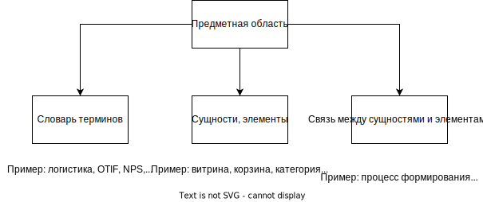

# 1. Анализ. Процесс мышления и принятия решения

Задачи анализа: 
- Прояснить сложный вопрос 
- Разложить сложный вопрос на элементы
- Найти причину или основание

Процесс принятия решения: от убеждений, суждений и принципов к действиям

**Роль аналитика в этом процессе:**
- *Задачи:*
	- Собирать суждения, убеждения и принципы -> анализировать и описывать предметную область -> создавать ее концептуальную схему
	- Задавать правильные вопросы -> создавать ситуации или задачи, которые позволят проверить исходные убеждения
	- Уметь обосновывать и опровергать убеждения, суждения, принципы перед заказчиком и командой
	- Способствовать принятию корректных решений

# 2. Предметная область. Или как аналитику взяться за решение задач

Анализ предметной области

Пример - новый интернет магазин, так как старый никому не нравится.
***Вопрос - какие вопросы о предметной области нужно задать?***
- ==Как добавить товар в корзину?==
- ==Как осуществляется поиск товаров клиентом?==
- ==Какой алгоритм поиска товаров по поисковым запросам?==
- ==Какими фильтрами пользуются чаще всего? Какими вообще не пользуются?==
- ==Как происходит оплата товара?==
- ==Как рассчитывается время доставки?==
- ==Как проверяется наличие товара в точках выдачи?==
- ==Кто является целевой аудиторией магазина?==
- ==Сколько в среднем времени проходит от добавления товара до его покупки?==
- ==Сколько товаров добавленных в корзину не доходят до покупки?==
**Правильные вопросы:**
Словарь терминов. Язык пользователей:
- Какие из этих терминов используются?
- Есть ли различия в использовании терминов разными людьми?
- Что означают для вас эти термины?
Главные объекты и роли:
- Кто ваши пользователи?
- Как отличаются их задачи?
- С чем взаимодействуют пользователи?
- Какие общие объекты важны?
Процессы:
- Как взаимодействуют пользователи?
- Как связаны сущности?
- Сколько этих связей?
- Какие у них свойства?

**Следующий шаг** - побеседовать с экспертами, чтобы узнать их убеждения. Задать вопросы, которые позволят прояснить цель, суть и детали задачи.
В качестве экспертов выбираем:
- Коллег по команде
- Непосредственного руководителя
- Будущих пользователей
- Лиц, принимающих решения
- Комьюнити: отраслевых специалистов и т.д.
***Вопрос - почему нельзя общаться с экспертами и собирать требования до самостоятельного изучения информации?***
- Невозможно составить исчерпывающий перечень вопросов с достаточной глубиной
- Будешь разговаривать с экспертами на разном языке, не понимая, что именно они говорят
- Много времени займет уточнение деталей, с которыми можно было ознакомиться самостоятельно

# 3. Mindmap. Инструмент анализа и описания предметной области

Инструмент, метод визуализации данных, который помогает структурировать информацию и находить взаимосвязи между ее составляющими

Основные элементы