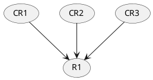

# 1. Что такое управление требованиями
Аналитик создает не просто требования, он создает **ЕДИНОЕ ВИДЕНЕНИЕ ПРОЕКТА**, описанное в соответствии с правилами и принципами (полнота, ясность, корректность, согласованность, верифицируемость, необходимость, осуществимость)
Нужно не только создать, но и донести до ВСЕХ участников проекта, которые должны принять единое видение проекта, детализированное на отдельные требования: ЛПР, заказчики, руководитель проекта, пользователи, администраторы, служба ТП, разработчики и др.

Каждый участник проекта:
- **Имеет** когнитивные искажения, эмоциональные состояния, внутренние ценности, воспитание
- **Подвержен** внешним факторам: экономика, политическая обстановка, конкуренты
- **Находится** в разном контексте: разные языки общения, терминология, менталитет, ценности корпоративной культуры и т.д.
Поэтому сложно обеспечить единое видение всех участников проекта

**Изменения требований**
Чем сложнее проект, чем больше функций, чем больше людей в проекте, чем более динамичный бизнес, тем *выше вероятность изменяемости требований*

ИЗМЕНЕНЕЯ В ЛЮБОМ СЛУЧАЕ БУДУТ!
ИЗМЕНЕНИЯ - ЭТО ЕСТЕСТВЕННО И ХОРОШО!

Поэтому цель аналитика - не противодействовать изменениям, а **научиться ими управлять и контролировать их** насколько возможно

**Управление требованиями** - все действия по обеспечению целостности, точности и своевременности обновлений требований в ходе проекта
1. Базовое состояние требований

```plantuml
@startuml
(R1)
@enduml
```

2. Порядок внесения изменения

3. Порядок согласования изменений

```plantuml
@startuml
(R2)
@enduml
```

**Базовые операции по управлению требованиями**
1. *Управление версиями*
- определение версий требований
- отслеживание версий отдельных требований и их наборов
2. Управление изменениями
- предложение требований
- анализ требований и их влияния
- принятие решений
- обновление требований
- обновление планов
- оценка изменчивости
3. Отслеживание состояния требований
- определение состояний
- фиксирование состояний
- отслеживание состояний
4. Отслеживание связей требований
- определение связей требований
- определение связей с другими системами

**Цель управления изменениями** - гарантировать, что организация документирует, проверяет и удовлетворяет потребности и ожидания её клиентов, внутренних или внешних стейкхолдеров

*Важное о коммуникациях:*
Для того, чтобы эффективно внедрять изменения, необходимо о них в текущем видении проекта **сообщить всей команде *незамедлительно*** и выделить значимость и полезность процессов изменений
Общение об изменениях должно происходить **лично** во время командных встреч (если онлайн, то включить камеру). Обязательно сообщить, зачем нужны эти изменения, какую цель они преследуют.
Всегда надо разговаривать с командой и делать это максимально быстро (доносить изменения).
# 2. Виды изменений требований
Классификация видов изменений:
- По источнику возникновения (Кто инициировал? Распределение ответственности между стейкхолдерами задаёт правила игры)
- По приоритету выполнения (срочное, плановое, нормальное)
- По объему влияния на систему (небольшое, крупное)
- По времени возникновения в ходе жизненного цикла проекта (проектирование, разработка ()самое тяжело воспринимаемое), эксплуатация)

Аналитик **ВСЕГДА** сначала **АНАЛИЗИРУЕТ** и **ОЦЕНИВАЕТ** риски, а только потом принимает решение, какое требование изменить первым. То есть всегда сначала придумываем и задаем вопросы, а потом что-то делаем

**Причины возникновения изменений**
1. **Внутренние причины:**
- При первоначальном выявлении требований нам не удалось задать правильные вопросы нужным людям в нужное время
- Не удалось создать практический процесс, позволяющий справиться с изменениями требований, которые являются нормой при пошаговой разработке:
	- менеджер не хочет вносить изменения вне плана
	- менеджер берет в работу вообще все изменения
- Все могли вносить изменения везде, вносить что угодно, когда угодно - продукт вышел из-под контроля
2. **Внешние причины:**
- Произошли изменения проблемы, которую мы пытались решить с помощью новой системы (изменилось законодательство, вышел федеральный продукт, решающий проблему и т.д.)
- Пользователи изменили свое мнение о том, чего они хотят от системы, или свои предпочтения
- Изменилась внешняя среда, что привело к появлению новых ограничений или новых возможностей
- Вошла в строй новая система
# 3. Процесс управления изменениями требований
**Шаги процесса управления изменениями:**
1. Осознать, что изменения неизбежны, и разработать план управления изменениями 
2. Сформировать базовый уровень требований
3. Установить единый канал контроля изменений
4. Использовать систему контроля изменений для их фиксации
5. Обрабатывать изменения по иерархическому принципу

**Набор атрибутов требования**
- дата создания
- номер текущей версии
- автор
- приоритет
- статус (состояние)
- источник требования
- логическое обоснование
- номер выпуска или итерации
- контактное лицо или ЛПР
- методы проверки или критерии приемки
- связи с другими требованиями

**Согласование изменений**
Должен быть зафиксирован состав людей, которые принимают решения о необходимости изменений. И порядок согласования изменений между ними.
Процесс согласования обратен процессу анализа:
**Анализ требования**    | (1) Представители заказчика (4) |
                     | (2) Руководитель проекта (3)      |
					 | (3) Бизнес-аналитик (2)               |
					 | (4) Технический специалист(1)   | **Согласование требования**

**Примерные статусы требования:**
1. 