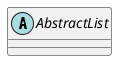

# 1. Нотации
Зачем?
- Слишком много самодельных и локальных подходов (не гибко, много времени на то ,чтобы обучить новых понимать локальные)
- Из-за этого недопонимания, разночтения и временные издержки

Нотация - это система условных обозначений или знаков, и правил их использования, принятая в конкретной методологии.
- Простота (низкий порог входа)
- Наглядность
- Индивидуальность
- Однозначность
# 2. UML
- Унифицированный (включает множество нотаций)
- Язык (имеет синтаксис, семантику, прагматику)
- Моделирования

Иерархия типов диаграмм (изучаемых в рамках курса)

