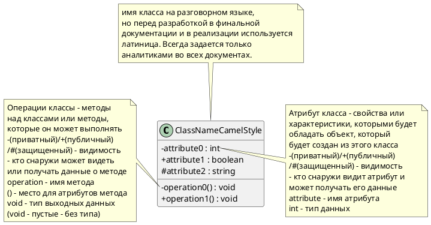
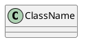
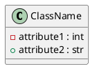
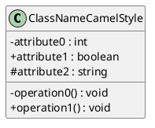

# 1. Нотации
Зачем?
- Слишком много самодельных и локальных подходов (не гибко, много времени на то ,чтобы обучить новых понимать локальные)
- Из-за этого недопонимания, разночтения и временные издержки

Нотация - это система условных обозначений или знаков, и правил их использования, принятая в конкретной методологии.
- Простота (низкий порог входа)
- Наглядность
- Индивидуальность
- Однозначность
# 2. UML
- Унифицированный (включает множество нотаций)
- Язык (имеет синтаксис, семантику, прагматику)
- Моделирования

Иерархия типов диаграмм (изучаемых в рамках курса)


# 3. Сущности UML
1. *Структурные*
- object - сущность, обладающая уникальностью и инкапсулирующая в себе состояние и поведение
- class - описание множества объектов с общими атрибутами, определяющими состояние, и операциями, определяющими поведение
(class) тел. справочник  - (объект) запись с атрибутами
- actor - сущность, находящаяся ВНЕ моделируемой системы и непосредственно взаимодействующая с ней
- artifact - элемент информации, который используется или порождается в процессе разработки ПО
Также есть:
- interface
- collaboration
- component
- node
2. *Поведенческие*
- state - период в жизненном цикле объекта, находясь в котором он удовлетворяет некоторому условию и осуществляет собственную деятельность или ожидает наступления некоторого события
- action - примитивное атомарное вычисление (минимальное действие, шаг)
- activty - (множество actions) - частный случай состояния, который характеризуется продолжительными по времени не атомарными вычислениями
3. *Группирующие*
- package - группа элементов модели, в том числе packages
- степень вложенности не ограничена
4. Аннотационные
- comment - произвольное по формату и содержанию описание одного или нескольких элементов модели (добавляет подробности)

# 4. Классы и отношения
*Структура*

 
Модификаторы видимости обычно указывают разработчики

**Допустимые варианты**
1. Шаблон для будущего заполнения атрибутов и методов

2. Самый часто используемы вариант в аналитике

3. Самый подробный вариант. Чаще всего используется в моделях от разработчиков

4. Самый верхний уровень - просто прямоугольник с именем класса - используется для быстрой визуализации или когда только начали строить модель и ничего неизвестно

**Отношения**
1. Ассоциация
```plantuml
class CatCafe

Cat - CatCafe: Lives in
```
