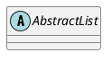

# 1. Нотации
Зачем?
- Слишком много самодельных и локальных подходов (не гибко, много времени на то ,чтобы обучить новых понимать локальные)
- Из-за этого недопонимания, разночтения и временные издержки

Нотация - это система условных обозначений или знаков, и правил их использования, принятая в конкретной методологии.
- Простота (низкий порог входа)
- Наглядность
- Индивидуальность
- Однозначность
# 2. UML
- Унифицированный (включает множество нотаций)
- Язык (имеет синтаксис, семантику, прагматику)
- Моделирования

Иерархия типов диаграмм (изучаемых в рамках курса)

# 3. Сущности UML
1. *Структурные*
- object - сущность, обладающая уникальностью и инкапсулирующая в себе состояние и поведение
- class - описание множества объектов с общими атрибутами, определяющими состояние, и операциями, определяющими поведение
(class) тел. справочник  - (объект) запись с атрибутами

