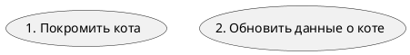
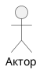
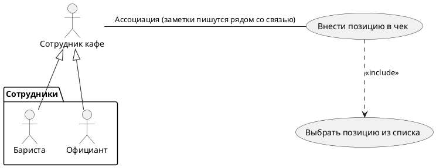

# 1. Для чего
**Use Case (Вариант использования)** - описание множества возможных последовательностей действий, событий, case'ов, приводящих к значимому для актора результату (соответствующего бизнес-требованию)

**Бизнес-вариант** использования описывает **бизнес-функциональность организации**
**Системный вариант** использования описывает **поведение информационной системы**

В системных ВИ - актор всегда находится вне системы, но с системой взаимодействует в рамках некоторой роли

В бизнес-ВИ - бизнес-работник - роль или набор ролей в бизнесе, которая взаимодействует с другими ролями и управляет бизнес-объектами, участвуя в реализации бизнес-вариантов использования

# 2. Связи и зависимости

Бариста и официант - наследники сотрудника кафе
Ассоциация - между актором и ВИ - говорит о том, что актору доступен этот ВИ
Обобщение - для уменьшения связей между акторами и ВИ
Зависимости - всегда только между ВИ (include, extend)

**Канонические зависимости**

include - обязательно выполняется при выполнении родительского ВИ
нужен для того, чтобы
extend - может не выполняться при выполнении родительского ВИ