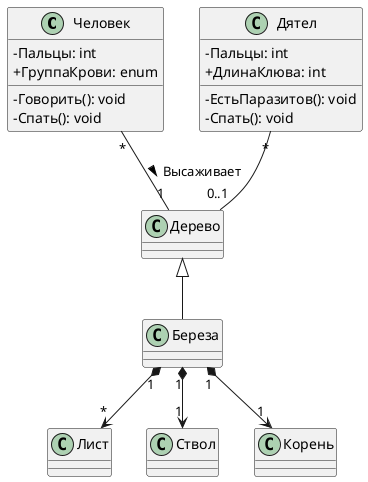
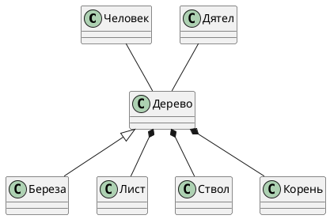

**Выполнив это задание, вы научитесь:**

1. Составлять диаграмму классов для дерева

**Чек-лист готовности к домашнему заданию**

- Просмотрен вебинар по теме «Унифицированный язык моделирования. Диаграмма классов»

**Описание задания**

1. Составьте диаграмму классов для дерева

**Инструкция к выполнению**  
Представьте, что система, которую вы опишете с помощью диаграммы — простое дерево, растущее за окном. UML помогает разглядеть лес за стволами деревьев.

Итак, вам представлен набор элементов для диаграммы:

Человек  
Дерево  
Лист  
Корень  
Берёза  
Ствол  
Дятел

ДлинаКлюва: int  
Жилки: int  
ДиапазонЦветовРастения: String (2 раза)  
ВозрастРастения: int  
ПротяжённостьСистемы: int  
Кольца: int  
ГруппаКрови: enum  
Пальцы: int (2 раза)  
ДиаметрСердцевины: int

СбрасыватьЛиству  
Фотосинтезировать  
Говорить  
ВсасыватьВещества  
ПередаватьВеществаКроне  
ПоддерживатьЖизньРастения  
Спать (2 раза)  
ЕстьПаразитов

Отношения:  
Ассоциация  
Композиция (3 раза)  
Обобщение  
Направленная ассоциация “высаживает”

**Ваша задача** — составить диаграмму и правильно расположить и связать между собой все элементы. Используйте только корректные ассоциации и укажите множественность там, где нужно.

Не забудьте проставить видимость и тип данных для атрибутов.

Слово “цветов” употреблено в значении “цвет” (colour), а не цветок.

Пример +- однозначный, особых разночтений быть не должно. У вас не должно получиться неполных классов, всегда будет название, хотя бы 1 атрибут и 1 метод.

**Формат сдачи работы:**

Для моделирования можно использовать любой удобный для вас инструмент. Схему необходимо прикрепить в формате картинки: PNG, JPG, JPEG, SVG.

**Чек-лист самопроверки:**

- Классы верно связаны между собой, все ассоциации корректны
- К классам правильно отнесены атрибуты и методы
- Множественность указана там, где нужно
- Множественность указана корректно
- Видимость атрибутов и классов указана

Это задание для самостоятельной работы, оно не будет проверяться экспертом.

Мой ответ:

Эталонный ответ:

Анализ:
- Корень, Ствол и Лист должны быть в композиции к дереву, а не к березе, так как эти объекты есть у всех деревьев. Невнимательно и не глубоко подумал
- СбрасыватьЛиству у березы, так как не все деревья имеют листву. Невнимательно и не глубоко подумал
- Не правильная множественность дятлов и людей. Дерево может садиться несколькими людьми. Также на одном дереве может быть много дятлов, как и один дятел может быть на нескольких деревьях. 
- С видимостью так и осталось не понятно - оставлю на откуп разработчикам
- Пропустил "Жилки" у Листа и "ПоддерживатьЖизньРастения" у Дерева