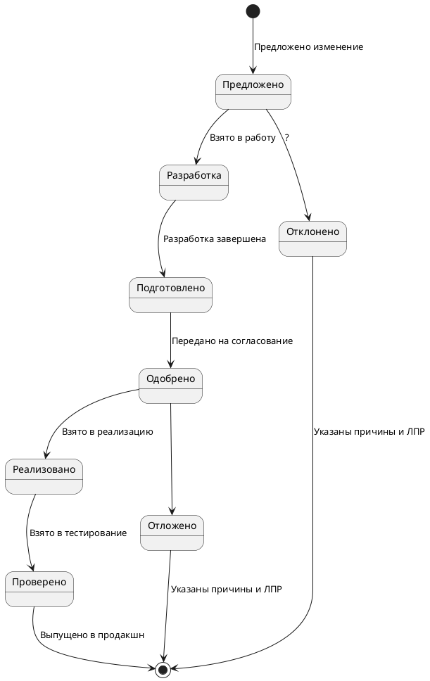

**Цель:** заполнить порядок согласования требования или изменения требования

**Контекст:**  
Представьте, что вы стали участником новой команды. Перед вами поставили задачу - нарисовать процесс, с целью презентации его команде и дальнейшего использования его в работе.

**Задание:**  
Составить описание бизнес-процесса (можно использовать любую известную подходящую нотацию: диаграмма активити или диаграмма состояний UML, блок-схема, BPMN).  
Путь согласования требования: от момента его инициации до завершения работы с требованием.  
Бизнес-процесс должен описать процесс перехода из одного состояния требования в другое (слайд #30). Подробное описание не нужно.

**Список всех состояний, который нужно использовать в процессе:**  
Предложено  
Разработка  
Подготовлено  
Одобрено  
Реализовано  
Проверено  
Отложено  
Удалено  
Отклонено

**Критерии оценивания**  
По итогу выполнения задания вы получите зачёт.
Задание считается **выполненным**, если:
- в процессе присутствуют все указанные состояния требований
- процесс выглядит логичным и не имеет структурных ошибок
- текст сформулирован в официально-деловом стиле
- у бизнес-процесса выделено начало и несколько возможных вариантов завершения (проверено, удалено, отклонено)
- в описании бизнес-процесса выделены блоки условий в моменты принятия решений
Задание будет отправлено **на доработку**, если:
- в процессе использованы не все состояния из списка выше
- в процессе есть структурные ошибки: бесконечные циклы, подвешенные блоки (без выхода), не обработаны все варианты условий

**Мой ответ:**

