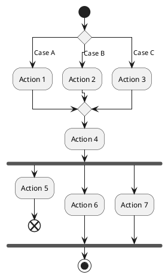
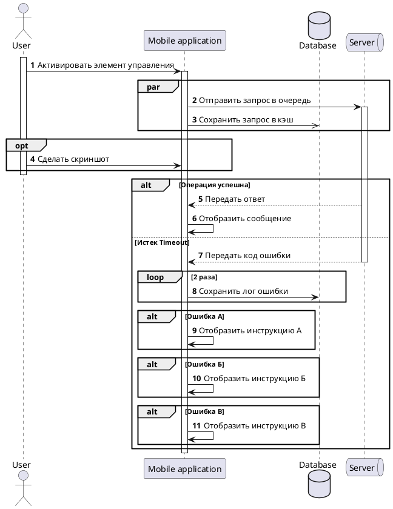
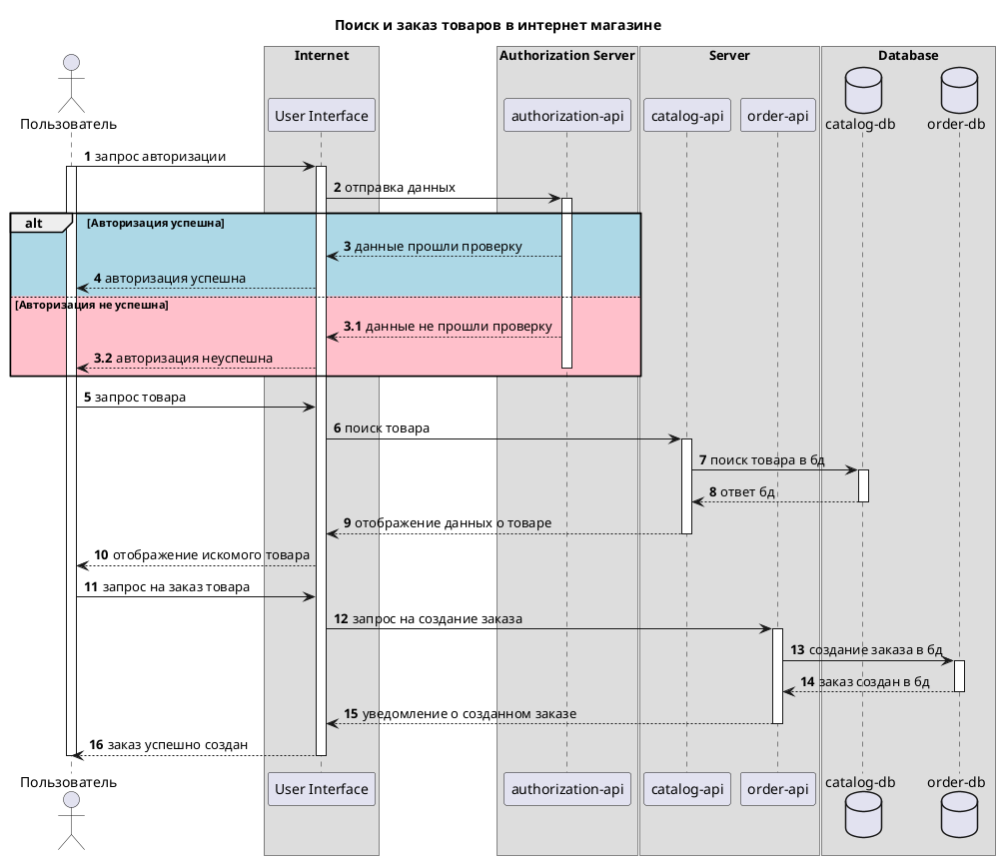

# 1. Диаграмма деятельности (Activity Diagram)
- Динамическое представление системы
- Представляет поток данных от функции к функции
- Схожа с блок-схемой
Применяется, когда надо нагляднее описать ВИ с большим количеством ветвлений (схожа с BPMN)

Элементы:

| Наименование                                                                                | Назначение                                                                                                    | Обозначение                                  |
| ------------------------------------------------------------------------------------------- | ------------------------------------------------------------------------------------------------------------- | -------------------------------------------- |
| Inintial Node, начальный узел                                                               | Точка начала процесса                                                                                         | Черный закрашенный круг                      |
| Control Flow, поток управления                                                              | Направление процесса                                                                                          | Стрелка (всегда в одну сторону)              |
| Action, действие (глагол + существительное)                                                 | Шаг (атомарный) процесса                                                                                      | Скругленный прямоугольник                    |
| Activity, деятельность (используется для упрощения диаграмм, зависит от уровня детализации) | Связка шагов (подпроцесс)                                                                                     | Скругленный прямоугольник с вилкой           |
| Decision, узел решения                                                                      | Выбор: процесс может идти по одному из путей в зависимости от условия                                         | Ромбик                                       |
| Guard condtion, условие ветвления                                                           | Варианты выбора на пути решения                                                                               | В квадратных скобках рядом с веткой процесса |
| Merge, слияние                                                                              | Точка объединения потоков, без условий ветвления                                                              | Ромбик                                       |
| Fork, вилка                                                                                 | Разветвление на параллельные независимые потоки                                                               | Черный узкий прямоугольник                   |
| Join, схождение                                                                             | Схождение параллельных потоков                                                                                | Черный узкий прямоугольник                   |
| Final Node, окончание процесса                                                              | Окончание всего процесса                                                                                      | Черный круг с обводкой                       |
| End of Flow, окончание потока                                                               | Окончание для потока, не вливающегося в общий поток. Должен быть закончен отдельно, а основной при этом - нет | Круг с Х внутри                              |
**Пример:**

**Условия ветвления**
- Взаимоисключающие
- Совокупность условий:
	- не должна содержать перекрытий
	- покрывает все случаи
У диаграммы также имеются дорожки (как у BPMN) - пример в домашнем задании

# 2. Диаграмма последовательности (Sequence Diagram)
- Отображает потоки данных между компонентами системы/между внешними системами/микросервисами
- 3 типа данных
	- Синхронное сообщение
	- Ответное сообщение
	- Асинхронное сообщение
**Пример**

--- - линия жизни объекта
закрашенная стрелка - синхронный запрос
не закрашенная стрелка - асинхронный запрос
прерывистая стрелка - ответ
прямоугольник на прерывистой линии - время активности объекта
par - параллельное выполнение действий
opt - опциональное действие
alt - альтернативные потоки, могут быть вложенными
loop -  цикл

