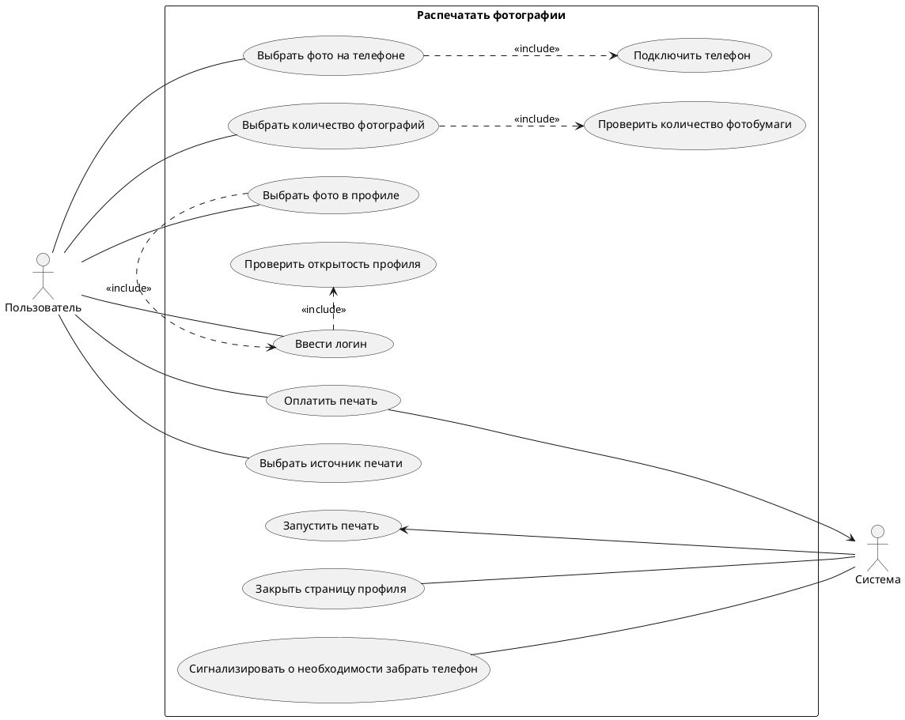

# Решение
## 1. Формализованные требования к разрабатываемому ПО

**Пользовательские требования:**

ПТ001. Пользователь должен иметь возможность выбрать количество фотографий перед печатью

ПТ002. Пользователь должен имеет выбор источника печати

**Функциональные требования**

ФТ001. Система должна проверять количество доступной фотобумаги для печати перед вводом количества печатаемых фотографий

ФТ002. Система должна закрывать профиль пользователя после печати всех фотографий, если печать осуществлялась из профиля Инстаграмм

ФТ003. Система должна сигнализировать о необходимости забрать телефон после печати всех фотографий, если печать осуществлялась с телефона

**Нефункциональные требования**

НФТ001. Система должна работать с телефонами под управлением iOS не ниже версии 10 и Android не ниже версии 12

НФТ002. Система должна принимать для оплаты карты платежных систем Visa, Mastercard, МИР, имеющие модули бесконтактной оплаты

## 2. Перечень вариантов использования для составления диаграммы ВИ
- Выбрать источник печати
- Подключить телефон
- Ввести логин
- Выбрать фото на телефоне
- Выбрать фото из профиля Инстаграм
- Проверить открытость профиля
- Выбрать количество фотографий
- Проверить количество фотобумаги
- Оплатить печать
- Запустить печать
- Закрыть страницу профиля
- Сигнализировать о необходимости забрать телефон

**Диаграмма вариантов использования**

## 3. Описание варианта использования

| **ID ВИ**                 | UC-5                                                                                                                                                                                                                                                                                                                                                                                                                                            |
| ------------------------- | ----------------------------------------------------------------------------------------------------------------------------------------------------------------------------------------------------------------------------------------------------------------------------------------------------------------------------------------------------------------------------------------------------------------------------------------------- |
| **Наименование ВИ**       | Выбрать фото в профиле                                                                                                                                                                                                                                                                                                                                                                                                                          |
| **Краткое описание ВИ**   | Пользователь выбирает фото в профиле после выбора источника печати и ввода логина                                                                                                                                                                                                                                                                                                                                                               |
| **Действующие лица**      | Пользователь                                                                                                                                                                                                                                                                                                                                                                                                                                    |
| **Предусловие**           | Успешно выполнен UC-2 Выбрать источник печати                                                                                                                                                                                                                                                                                                                                                                                                   |
| **Постусловие**           | В случае успешного выполнения основного потока, система предлагает выбрать количество фото для печати.                                                                                                                                                                                                                                                                                                                                          |
| **Триггер**               | Пользователь выбрал опцию "Печатать из профиля Инстаграм"                                                                                                                                                                                                                                                                                                                                                                                       |
| **Основной поток**        | 1. Система предлагает пользователю выбрать фото в профиле Инстаграм 2. Пользователь выбирает фото из профиля  3. Система запрашивает у пользователя подтверждения выбора файла для печати 4. **Если** выбранный файл является файлом изображения, то управление переходит на следующий шаг 5. **Если**  пользователь подтверждает выбор, то управление переходит на следующий шаг 6. Вариант использования завершает свою работу |
| **Альтернативные потоки** | 5а. Пользователь не подтверждает выбор фото для печати 1. Управление переходит на шаг 2 основного потока                                                                                                                                                                                                                                                                                                                                     |
| **Потоки исключения**     | 4а. Выбранный файл не является изображением 1. Система сообщает, что выбранный файл не является изображением 2. Система закрывает страницу профиля 3. Вариант использования завершает свою работу                                                                                                                                                                                                                                      |
| **Результат**             | В случае успешного выполнения ВИ, покупателю предлагается выбрать количество фото для печати                                                                                                                                                                                                                                                                                                                                                    |
## 4. Системные ошибки для обработки
1. Не найден профиль по указанному логину
2. Нет доступа к хранилищу телефона
3. Не верный формат файла
4. Не поддерживаемая версия операционный системы
5. Недостаточное количество фотобумаги для печати выбранного количества фото
6. Выбранный профиль закрыт
7. Оплата не прошла
8. Время для оплаты вышло
9. Телефон не забрали
10. Ошибка печати (зажевало бумагу, закончились чернила и т.д.)
11. Нет доступа к Интернет