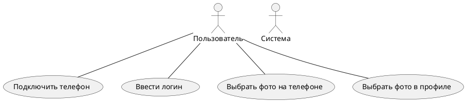

**Контекст:**
Я - аналитик команды, которая разрабатывает программное обеспечение для автомата, печатающего фото из инсты.
На встрече с представителем заказчика выяснили, то автомат должен работать следующим образом:
1. При нажатии на кнопку "Выбрать фото для печати" на главном экране пользователю предложены 2 способа - выбрать фото в инсте или загрузить фото с телефона
2. Для выбора фото из инсты пользователю необходимо указать свой логин. Профиль пользователя должен быть открытым
3. Для выбора фото с телефона, пользователю нужно соединить телефон с автоматом для печати фото через кабель зарядки
4. Пользователь может выбрать количество фотографий для печати через экран автомата. Минимальное количество фото - 1, максимальное - 100 (если в автомате достаточно бумаги)
5. Оплатить печать можно только по карте через физический терминал бесконтактной оплаты
6. Печать фото запускается после успешной оплаты выбранного пакета фотографий.
7. Если пользователь вводил логин инсты для печати фотографий, то после завершения печати его страница в автомате должна быть закрыта
8. Если пользователь присоединял телефон для печати фотографий, то после завершения печати автомат будет сигнализировать о необходимости забрать телефон

**Задание**
1. Написать минимум 5 формализованных требований к разрабатываемому программному обеспечению (желательно разных типов, но на мое усмотрение)
2. Подготовить диаграмму вариантов использования, покрывающую описанные в контексте действия
3. Подготовить текстовое описание любого варианта использования из получившейся на шаге 2 диаграммы
4. (опционально) Подумать и описать словами, обработку каких системных ошибок нужно учесть при реализации программного обеспечения

**Зачёт:**  
Задание считается выполненным, если:
- описано не менее 5 требований к программному обеспечению
- требования сформулированы лаконично, в официально-деловом стиле изложения
- требования не противоречат друг другу
- требования обладают всеми свойствами хороших требований: полнота, ясность, корректность, согласованность, верифицируемость, осуществимость
- в диаграмме присутствует действующее лицо
- верно определены связи между кейсами
- кейс описан логично, структурные ошибки отсутствуют

**На доработку:**
- описаны менее 5 требований к ПО
- требования не формализованы
- диаграмма описывает последовательность действий, а не варианты использования
- диаграмма не сходится с текстовым описанием
**Незачёт:**
- задание не выполнено в полном объёме
- решение после многократных доработок всё ещё требует доработки

# Решение
## 1. Формализованные требования к разрабатываемому ПО

ПТ001. Пользователь должен иметь возможность выбрать количество фотографий перед печатью

ПТ002. Пользователь должен имет выбор источника печати

ФТ001. Система должна проверять количество доступной фотобумаги для печати перед вводом количества печтаемых фотографий

ФТ002. Система должна закрывать профиль пользователя после печати всех фотографий, если печать осуществлялась из профиля Инстаграмм

ФТ003. Система должна сигнализировать о необходимости забрать телефон после печати всех фотографий, если печать осуществлялась с телефона

НФТ001. Система должна работать с телефонами под управлением iOS не ниже версии 10 и Android не ниже версии 12

НФТ002. Система должна принимать для оплаты карты платежных систем Visa, Mastercard, МИР, имеющие модули бесконтактной оплаты

## 2. Перечень вариантов использования для составления диаграммы ВИ
- Выбрать источник печати
- Подключить телефон
- Ввести логин
- Выбрать на телефоне
- Выбрать из профиля
- Проверить открытость профиля
- Выбрать количество фотографий
- Проверить количество фотобумаги
- Оплатить печать
- Запустить печать
- Закрыть страницу профиля
- Сигнализировать о необходимости забрать телефон

