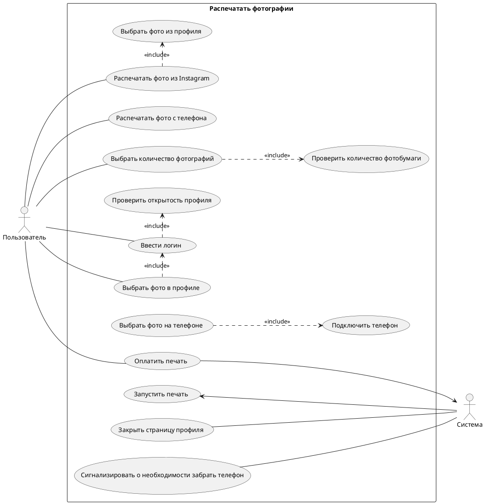

**Контекст:**
Я - аналитик команды, которая разрабатывает программное обеспечение для автомата, печатающего фото из инсты.
На встрече с представителем заказчика выяснили, то автомат должен работать следующим образом:
1. При нажатии на кнопку "Выбрать фото для печати" на главном экране пользователю предложены 2 способа - выбрать фото в инсте или загрузить фото с телефона
2. Для выбора фото из инсты пользователю необходимо указать свой логин. Профиль пользователя должен быть открытым
3. Для выбора фото с телефона, пользователю нужно соединить телефон с автоматом для печати фото через кабель зарядки
4. Пользователь может выбрать количество фотографий для печати через экран автомата. Минимальное количество фото - 1, максимальное - 100 (если в автомате достаточно бумаги)
5. Оплатить печать можно только по карте через физический терминал бесконтактной оплаты
6. Печать фото запускается после успешной оплаты выбранного пакета фотографий.
7. Если пользователь вводил логин инсты для печати фотографий, то после завершения печати его страница в автомате должна быть закрыта
8. Если пользователь присоединял телефон для печати фотографий, то после завершения печати автомат будет сигнализировать о необходимости забрать телефон

**Задание**
1. Написать минимум 5 формализованных требований к разрабатываемому программному обеспечению (желательно разных типов, но на мое усмотрение)
2. Подготовить диаграмму вариантов использования, покрывающую описанные в контексте действия
3. Подготовить текстовое описание любого варианта использования из получившейся на шаге 2 диаграммы
4. (опционально) Подумать и описать словами, обработку каких системных ошибок нужно учесть при реализации программного обеспечения

**Зачёт:**  
Задание считается выполненным, если:
- описано не менее 5 требований к программному обеспечению
- требования сформулированы лаконично, в официально-деловом стиле изложения
- требования не противоречат друг другу
- требования обладают всеми свойствами хороших требований: полнота, ясность, корректность, согласованность, верифицируемость, осуществимость
- в диаграмме присутствует действующее лицо
- верно определены связи между кейсами
- кейс описан логично, структурные ошибки отсутствуют

**На доработку:**
- описаны менее 5 требований к ПО
- требования не формализованы
- диаграмма описывает последовательность действий, а не варианты использования
- диаграмма не сходится с текстовым описанием
**Незачёт:**
- задание не выполнено в полном объёме
- решение после многократных доработок всё ещё требует доработки

# Решение
## 1. Формализованные требования к разрабатываемому ПО

**Пользовательские требования:**

ПТ001. Пользователь должен иметь возможность выбрать количество фотографий перед печатью

ПТ002. Пользователь должен имеет выбор источника печати

**Функциональные требования**

ФТ001. Система должна проверять количество доступной фотобумаги для печати перед вводом количества печатаемых фотографий

ФТ002. Система должна закрывать профиль пользователя после печати всех фотографий, если печать осуществлялась из профиля Инстаграм

ФТ003. Система должна сигнализировать о необходимости забрать телефон после печати всех фотографий, если печать осуществлялась с телефона

**Нефункциональные требования**

НФТ001. Система должна работать с телефонами под управлением iOS не ниже версии 10 и Android не ниже версии 12

НФТ002. Система должна принимать для оплаты карты платежных систем Visa, Mastercard, МИР, имеющие модули бесконтактной оплаты

## 2. Перечень вариантов использования для составления диаграммы ВИ
- Выбрать источник печати
- Подключить телефон
- Ввести логин
- Выбрать фото на телефоне
- Выбрать фото из профиля Инстаграм
- Проверить открытость профиля
- Выбрать количество фотографий
- Проверить количество фотобумаги
- Оплатить печать
- Запустить печать
- Закрыть страницу профиля
- Сигнализировать о необходимости забрать телефон

**Диаграмма вариантов использования**

## 3. Описание варианта использования

| **ID ВИ**                 | **UC-1**                                                                                                                                                                                                                                                                                                                                                                                                                                                                                                                                                                                                                                                                                                                                                                                                                                                                                                                                                                                                                                                |
| ------------------------- | ------------------------------------------------------------------------------------------------------------------------------------------------------------------------------------------------------------------------------------------------------------------------------------------------------------------------------------------------------------------------------------------------------------------------------------------------------------------------------------------------------------------------------------------------------------------------------------------------------------------------------------------------------------------------------------------------------------------------------------------------------------------------------------------------------------------------------------------------------------------------------------------------------------------------------------------------------------------------------------------------------------------------------------------------------- |
| **Наименование ВИ**       | Распечатать фото                                                                                                                                                                                                                                                                                                                                                                                                                                                                                                                                                                                                                                                                                                                                                                                                                                                                                                                                                                                                                                        |
| **Краткое описание ВИ**   | Пользователь распечатывает фото с телефона или из профиля в Инстаграм                                                                                                                                                                                                                                                                                                                                                                                                                                                                                                                                                                                                                                                                                                                                                                                                                                                                                                                                                                                   |
| **Действующие лица**      | Пользователь                                                                                                                                                                                                                                                                                                                                                                                                                                                                                                                                                                                                                                                                                                                                                                                                                                                                                                                                                                                                                                            |
| **Предусловие**           | Автомат свободен и готов к работе                                                                                                                                                                                                                                                                                                                                                                                                                                                                                                                                                                                                                                                                                                                                                                                                                                                                                                                                                                                                                       |
| **Постусловие**           | В случае успешного выполнения основного потока, система распечатает выбранное количество выбранной пользователем фотографии                                                                                                                                                                                                                                                                                                                                                                                                                                                                                                                                                                                                                                                                                                                                                                                                                                                                                                                             |
| **Триггер**               | Пользователь выбрал опцию "Распечатать фотографию"                                                                                                                                                                                                                                                                                                                                                                                                                                                                                                                                                                                                                                                                                                                                                                                                                                                                                                                                                                                                      |
| **Основной поток**        | 1. Система предлагает пользователю выбрать источник для печати 2. **Если** пользователь в качестве источника выбран "Профиль в Инстаграм", то управление переходит на следующий шаг 3. Система предлагает ввести логин от профиля 4. Пользователь вводит логин от профиля и подтверждает ввод 5. Система проверяет доступ к профилю 6. **Если** профиль доступен, то управление переходит на следующий шаг 7. Система открывает профиль 8. Пользователь выбирает фото для печати и выбирает опцию "Распечатать фото" 9. Система проверяет количество фото для бумаги и предлагает выбрать количество фото для печати 10. Пользователь вводит количество фото для печати и подтверждает ввод 11. Система сообщает стоимость услуги и активирует терминал для оплаты  12. Пользователь оплачивает печать 13. **Если** оплата прошла успешно, то управление переходит на следующий шаг 14. Система печатает фотографии 15. Система закрывает страницу профиля 16. Вариант использования завершает свою работу |
| **Альтернативные потоки** | 2а. Пользователь выбрал опцию "Распечатать с телефона" 1. Система сообщает о необходимости подключить телефон 2. Пользователь подключает телефон к автомату через кабель 3. Система просит пользователя указать расположение хранилища                                                                                                                                                                                                                                                                                                                                                                                                                                                                                                                                                                                                                                                                                                                                                                                                         |
| **Потоки исключения**     | 4а. Выбранный файл не является изображением 1. Система сообщает, что выбранный файл не является изображением 2. Система закрывает страницу профиля 3. Вариант использования завершает свою работу                                                                                                                                                                                                                                                                                                                                                                                                                                                                                                                                                                                                                                                                                                                                                                                                                                              |
| **Результат**             | В случае успешного выполнения ВИ, покупателю предлагается выбрать количество фото для печати                                                                                                                                                                                                                                                                                                                                                                                                                                                                                                                                                                                                                                                                                                                                                                                                                                                                                                                                                            |
## 4. Системные ошибки для обработки
1. Не найден профиль по указанному логину
2. Нет доступа к хранилищу телефона
3. Не верный формат файла
4. Не поддерживаемая версия операционный системы
5. Недостаточное количество фотобумаги для печати выбранного количества фото
6. Выбранный профиль закрыт
7. Оплата не прошла
8. Время для оплаты вышло
9. Телефон не забрали
10. Ошибка печати (зажевало бумагу, закончились чернила и т.д.)
11. Нет доступа к Интернет